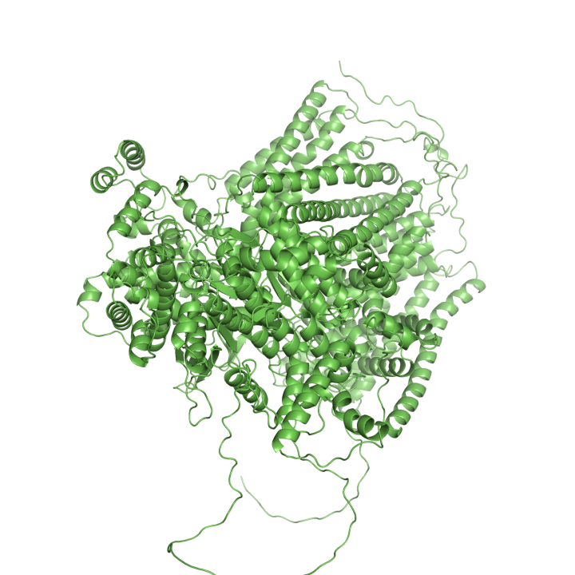
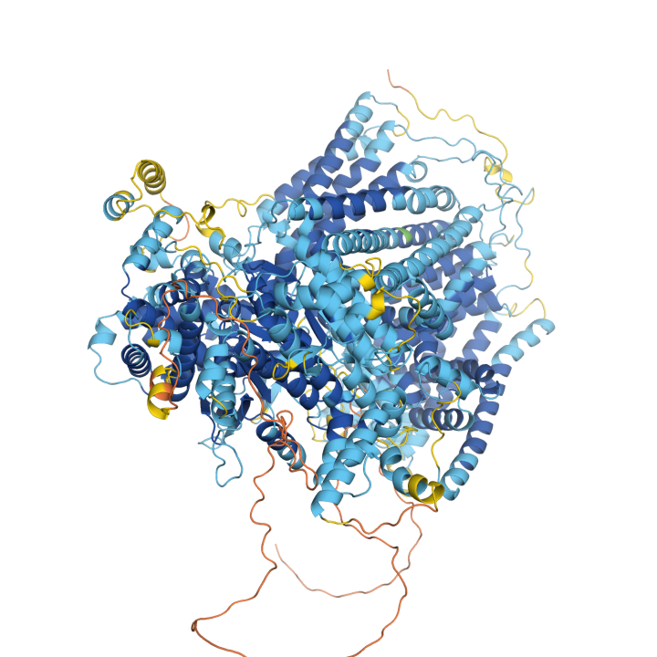

This is a pymol extension to color structures from the [AlphaFold Protein Structure Database](https://alphafold.ebi.ac.uk/) by pLDDT.

1. Load extension into pymol. In the pymol command prompt:
```
run https://raw.githubusercontent.com/JinyuanSun/pymol-color-alphafold/master/coloraf.py
```


2. Invoke the extension in the pymol command prompt as so:
```
coloraf model_name
bg_color white
set spec_reflect, 0
set ray_trace_mode, 0
```

